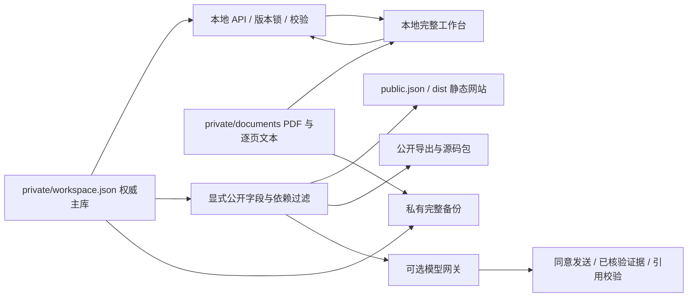

# 当前架构

保留 React + Vite + Node 与开放 JSON。新增本地持久化服务，公开网站继续使用静态产物，不引入云账号或数据库。

尚未初始化时，content 是模板来源；初始化后只由 private/workspace.json 担任主库。显式 init 只复制一次且全部默认私有。src/generated 和 dist 是公开派生物，不人工维护。

## 服务与持久化

`services/workspace-store.mjs` 负责读取、初始化、单记录更新、revision、原子替换、备份和恢复。写入、PDF 导入与备份/恢复共用独占锁；旧 revision 返回冲突。恢复先产生安全备份，再恢复数据与附件选择，并生成新 revision。文件系统方案面向单用户本机，不声称跨多文件数据库级事务。

每次提交前会把上一版完整 workspace envelope 写入 `private/history/`，按文件数量保留最近 100 个。历史 API 只提供已校验的 JSON 快照和元数据；它不替代包含 PDF/配置的完整备份，也不会被公开构建或源码包收录。

`services/local-server.mjs` 默认监听 127.0.0.1:4176，服务 dist 并注入本地模式标记。GET workspace 返回完整 dataset、附件索引和本次服务 token；POST records/backup/restore/documents/import 执行持久操作。Host、Origin、Fetch-Site 和变更 token 保护本地请求；私有响应 no-store，无 CORS。启动要求已初始化，读库失败不会静默回退。

`services/pdf.mjs` 使用 pdfjs-dist 保留原件、SHA-256 和逐页文本。附件身份稳定，主库存 documentIds 选择当前恢复点中的附件；未选择的旧 blob 不自动出现在 API 或检索中。原件和解析记录永不自动纳入公开包。

## 前端与检索

`src/main.jsx` 负责基本路由与浏览，`src/workspace.jsx` 负责编辑、维护、原文对照和研究查询。Hash 路由在静态子路径下可刷新。比较选择可保存在浏览器，但论文主数据由文件持久化。完整本地数据进入本机页面；公开静态页面只装入公开投影。

`src/lib/knowledge.mjs` 提供规范化、AND 检索、邻域、比较和统计；`search-v2.mjs` 增加 metadata/notes/evidence/pdf 范围、别名命中、分字段词法排序和片段出处。baseline、graph、ranked 是可解释策略，不是三个模型；增强排序不等于语义理解。

`src/lib/database.mjs` 还提供数据库属性和视图的确定性计算层。公式使用白名单函数和递归下降解析器，汇总只沿明确的论文关联属性读取数据；派生值不写回主库，因此修改基础论文或关系后，筛选、排序、分组和导出会直接反映当前版本。未知引用、循环依赖和不匹配的数值聚合在保存前拒绝。

审核关系最多扩展两跳，保留类型、方向和证据；允许遍历的边不表示结论相互蕴含。archived 论文及其依赖从默认作用域排除。统计由程序计算，模型不负责数量。

## 模型边界

`services/model-adapter.mjs` 复用 OpenAI-compatible Chat Completions 接口：服务端配置、请求超时、大小限制、引用 ID 检查。`services/server.mjs` 提供独立的只读公开网关；本地服务调用同一实现，但每次重新读取当前主库再过滤。

客户端不能上传任意 evidence 代替服务器检索。仅发送显式同意的问题和最多 8 条公开 verified source/note 证据；personalAnalysis、私有证据和 PDF 全文不发送。引用有效只说明 ID 属于本次上下文，不证明事实支持。配置存在不等于提供方连通；真实模型未在本次交付中调用。

笔记、原文与模型输出都是不可信文本；不执行其中指令，Markdown 原始 HTML 关闭，外部图片不自动加载。数据规模超过单文件及浏览器合理开销后再考虑增量索引或轻量数据库；当前未验证万篇级容量。

## 统一产品层与草稿

`src/ui.jsx` 提供五区导航、全局搜索/新建、工作台和共享页面组件，`src/ui.css` 管理布局与阅读排版。数据库和实体仍使用既有领域模块；`src/reading.jsx` 复用 PDF.js，实现原文和笔记并排。旧公开浏览器编辑器、旧概览和重复实体详情已移除，旧 URL 保留路由兼容。

`services/drafts.mjs` 保存 private/draft-inbox 内的完整记录、来源、修改前快照和 baseRevision；网页与 ai:draft --stage 共用该接口。应用仍调用 putRecord，版本变化停止写入。草稿仅接受 private 记录，已应用正文进入主库正常备份；待审收件箱需要单独导出。

比较组合可保存至 topic.compareIds；study:export 显式生成本地材料并保留来源。公开 export 与源码包继续只读公开投影。
